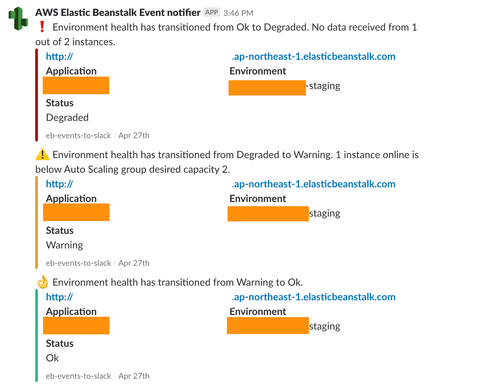

# ElasticBeanstalk notifier

This is a bot that runs on AWS Lambda which notifies Slack of AWS 
ElasticBeanstalk events via AWS SNS.

## How to use
Deploy this python script on AWS Lambda and connect SNS topic which receives 
the events of ElasticBeanstalk.

## Screenshot

## Contribution
The contribution to this project is very very welcome. 
If you find some bugs, please feel free to submit an issue.

## LICENSE
Copyright 2018 Ryosuke Sato

Licensed under the MIT License.
